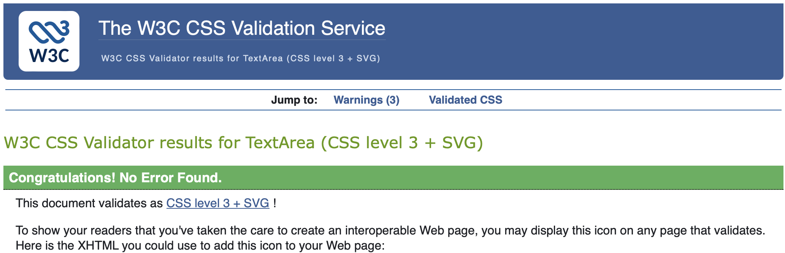
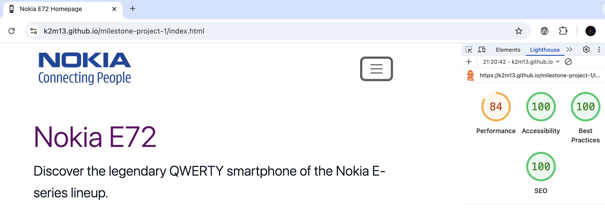

# Nokia E72 Smartphone Documentation Website

A responsive documentation website dedicated to the Nokia E72, a classic business smartphone known for its durable design, efficient QWERTY keyboard, and productivity-focused features.

## Table of Contents

1. [UX](#ux)
### [Project Goals](#project-goals-1)
### [Developer and Business Goals](#developer-and-business-goals-1)
### [User Stories](#user-stories-1)
### [Design Choices](#design-choices-1)
### [Wireframes](#wireframes-1)

2. [Features](#features)
### [Existing Features](#existing-features-1)
### [Features Left to Implement](#features-left-to-implement-1)

3. [Technologies Used](#technologies-used)

4. [Testing](#testing)

5. [Deployment](#deployment)
### [Steps](#steps-1)
### [How to Run This Project Locally](#how-to-run-this-project-locally-1)

6. [Credits](#credits)
### [Content](#content-1)
### [Media](#media-1) 
### [Code](#code-1)
### [Acknowledgements](#acknowledgements-1) 

 
## UX 
### Project Goals
### Developer and Business Goals

1.	Preserve and share knowledge: Create a reliable resource about the Nokia E72, including its specs, manuals, and visuals.
2.	Build engagement: Allow visitors to reach out with questions or contributions via a contact form.
3.	Accessibility: Present content in a clear, simple layout that works well on desktop and mobile.
4.	SEO value: Attract visitors searching for Nokia E72 documentation, history, or nostalgia content.

### User Stories
**Homepage** (description + gallery)
- As a nostalgic phone enthusiast, I want to read a short description of the Nokia E72, so I can quickly understand its history and importance.
- As a visitor, I want to view a gallery of high-quality photos, so I can see the design details of the device.

**Documentation subpage** (manuals + specs table)
- As a user who owns a Nokia E72, I want to download the user manual, so I can learn how to operate the phone.
- As a repair technician or hobbyist, I want to access the service manual, so I can understand repair procedures.
- As a researcher or collector, I want to view a clear technical specifications table, so I can compare the E72 with other phones.
Contact subpage (form)
- As a visitor, I want to use a simple contact form, so I can ask questions or provide feedback about the website.
- As the site owner, I want inquiries sent to my email, so I can respond and engage with users.

### Design Choices

### Wireframes
Home, Documentation, Support, Thank-You

### Tasks

**Homepage**
- Write a short, engaging description of the Nokia E72 (release date, features, relevance).
- Prepare and optimise gallery images (resize, compress for fast loading).
- Build homepage layout with description section + gallery grid/lightbox.

**Documentation Subpage**
- Source/upload user manual (PDF).
- Source/upload service manual (PDF).
- Create a clean specifications table (processor, display, camera, OS, memory, connectivity, etc.).
- Ensure all downloads are accessible and properly linked.

**Contact Subpage**
- Build a simple contact form with fields: Name, Email, Message, Attach File.
- Add validation (email format, required fields).
- Add thank-you/confirmation message after submission.

**General**
- Create simple, consistent navigation bar linking Homepage, Documentation, Contact.
- Apply responsive design (mobile-friendly).
- Test across major browsers.
- Add metadata for SEO (title, description, keywords like ‘Nokia E72 user manual’, ‘Nokia E72 specs’).

### Must-Haves (MVP – launch-ready)

**Homepage**
- [ ] Write concise description of Nokia E72 (history, features).
- [ ] Create image gallery (3–6 optimized photos).
- [ ] Implement responsive layout (grid/lightbox for gallery).

**Documentation Subpage**
- [ ] Upload and link user manual (PDF).
- [ ] Upload and link service manual (PDF).
- [ ] Build technical specifications table (CPU, OS, memory, camera, battery, etc.).

**Contact Subpage**
- [ ] Create contact form (Name, Email, Message).
- [ ] Add basic validation (required fields, email format).
- [ ] Connect to email service (Formspree / Netlify Forms).
- [ ] Add confirmation message after submission.

**General / Core Site**
- [ ] Navigation bar with links to Homepage, Documentation, Contact.
- [ ] Responsive design (desktop, tablet, mobile).
- [ ] Test in major browsers (Chrome, Edge, Firefox, Safari).
- [ ] Add favicon, site title, and meta description.

## Accessibility
Added ARIA labels and roles for navigation, carousel, and gallery for improved accessibility.

## Website Map

## Colour Scheme

- text #051122
- heading #63036A purple
- background #FFFFFF white
- button, URL #06C6B5 teal

## Contrast

## Favicon

Favicon was found on [ICONFINDER](https://www.iconfinder.com/search?q=nokia)

Favicon was generated on [RealFaviconGenerator](https://realfavicongenerator.net) 

## Features
### Existing Features
### Features Left to Implement

## Technologies Used

## Testing
HTML and CSS was tested and validates using [W3C Validator](https://validator.w3.org)

W3C CSS Validator Test

Lighthouse Test

## Deployment
This project was deployed to GitHub pages using Visual Studio Code.

### Steps
1. The project was created locally in Visual Studio Code.
2. Tracked using Git and pushed to a public GitHub repository.
3. Deployed via GitHub Pages using the main branch.
4. The live site is available at: https://k2m13.github.io/milestone-project-1/

### How to Run This Project Locally
1. Go to the repository: https://github.com/k2m13/milestone-project-1
2. Click Code → Download ZIP.
3. Extract the files and open index.html in your browser.
4. Alternatively, clone the repository using: 
`git clone https://github.com/k2m13/milestone-project-1.git`

## Credits
### Content
All text content was written by the developer based on publicly available Nokia E72 product information.

### Media

Images for the website were sources from these pages:
* https://1000logos.net/nokia-logo/

* https://usashopwe.shop/ProductDetail.aspx?iid=724322550&pr=73.88

* https://manualzz.com/doc/o/lmeqi/nokia-e72-manual-de-usuario-linterna

* https://www.joom.com/en/products/658157f86b5257011f155f1f?srsltid=AfmBOoo71fwRLoPpf1Xm64jgWhkDktB1wiC0kfSKZ-nd2mFFn1Yeb2Ya 

* https://www.independent.co.uk/tech/nokia-gets-new-communicator-app-office-suite-as-it-shake-hands-with-microsoft-1964544.html

* https://www.ebay.co.uk/itm/135222103882

* https://www.gearbest.ma/product/finland-made-e72-mobile-cell-phone-gsm-2g-3g-unlocked-5mp-camera-240x320-display-resolution-support-multi-language-used-phone/

* https://www.ebay.co.uk/itm/335440241218

* https://www.slashgear.com/otterbox-nokia-e72-cases-arrive-1065709/

### Code
* Bootstrap documentation for component structure and responsive grid system.
* CSS variables and structure inspired by modern front-end best practices.

### Acknowledgements 