# Nokia E72 Smartphone Documentation Website

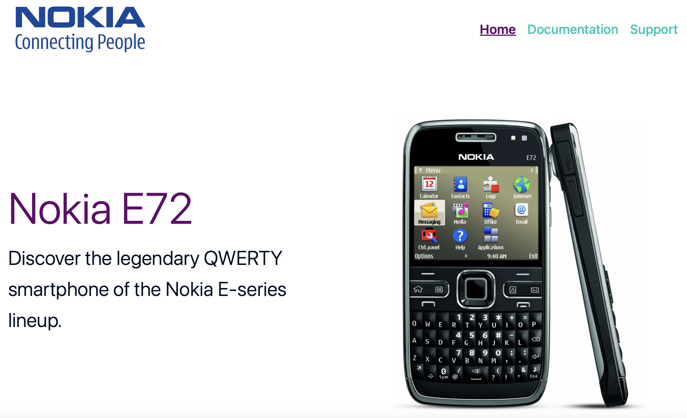


A responsive documentation website dedicated to the Nokia E72, a classic business smartphone known for its durable design, efficient QWERTY keyboard, and productivity-focused features.

**Live Demo:** [View on GitHub Pages](https://k2m13.github.io/milestone-project-1/)

## Table of Contents

1. [UX](#ux)
    - [Developer and Business Goals](#developer-and-business-goals)
    - [User Stories](#user-stories)
    - [Design Choices](#design-choices)
    - [Wireframes](#wireframes)

2. [Features](#features)
    - [Development Plan](#development-plan)
    - [Must-Haves](#must-haves-mvp--launch-ready)
    - [Existing Features](#existing-features)
    - [Features Left to Implement](#features-left-to-implement)
    - [Stretch Goals](#stretch-goals)

3. [Technologies Used](#technologies-used)

4. [Testing](#testing)

5. [Deployment](#deployment)
    - [Steps](#steps)
    - [How to Run This Project Locally](#how-to-run-this-project-locally)

6. [Credits](#credits)
    - [Content](#content)
    - [Media](#media) 
    - [Code](#code)
    - [Acknowledgements](#acknowledgements) 
    - [Disclaimer](#disclaimer)

7. [License](#license)

---
## UX 
The UX section outlines the design process, planning, and reasoning behind the Nokia E72 documentation website, focusing on user needs, accessibility and project goals.

### Developer and Business Goals
The main objectives of this project from both developer and user perspectives include:

1.	Preserve and share knowledge: Create a reliable resource about the Nokia E72, including its specs, manuals, and visuals.
2.	Build engagement: Allow visitors to reach out with questions or contributions via a contact form.
3.	Accessibility: Present content in a clear, simple layout that works well on desktop and mobile.
4.	SEO value: Attract visitors searching for Nokia E72 documentation, history, or nostalgia content.

### User Stories
**Homepage** (description + gallery)
- As a nostalgic phone enthusiast, I want to read a short description of the Nokia E72, so I can quickly understand its history and importance.

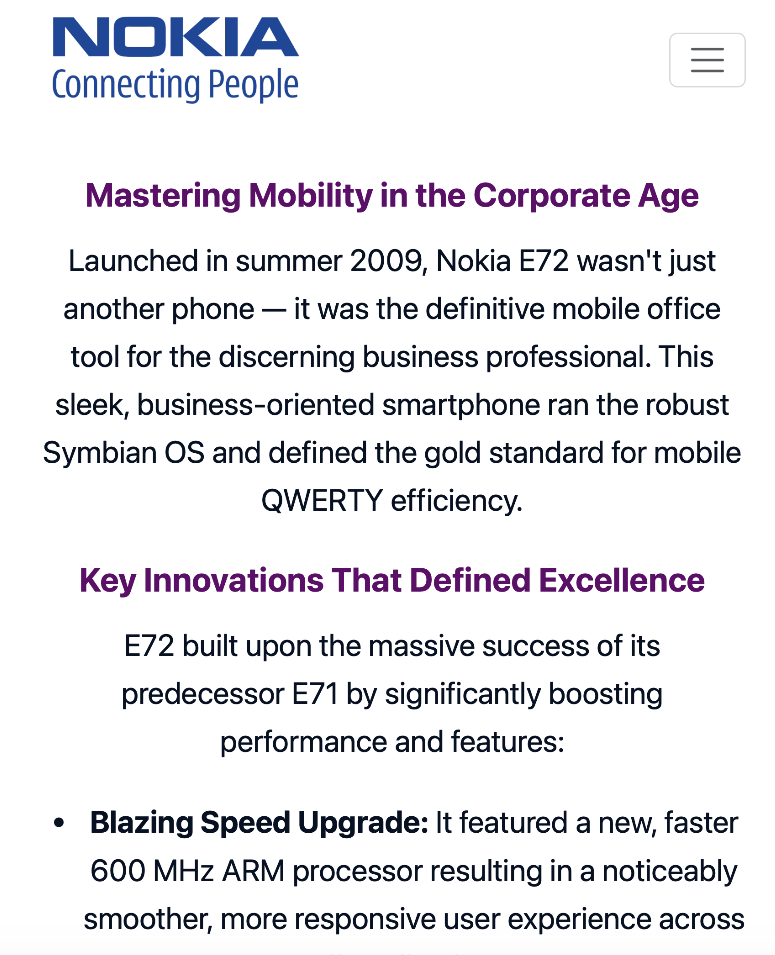
- As a visitor, I want to view a gallery of high-quality photos, so I can see the design details of the device.

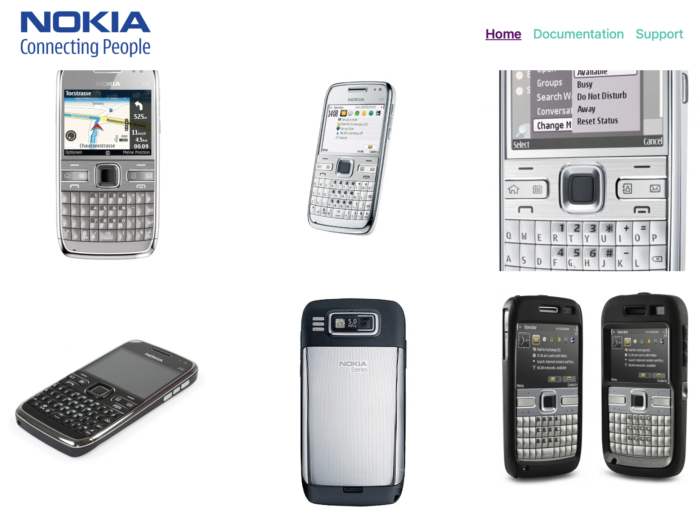

**Documentation subpage** (manuals + specs table)
- As a user who owns a Nokia E72, I want to download the user manual, so I can learn how to operate the phone.

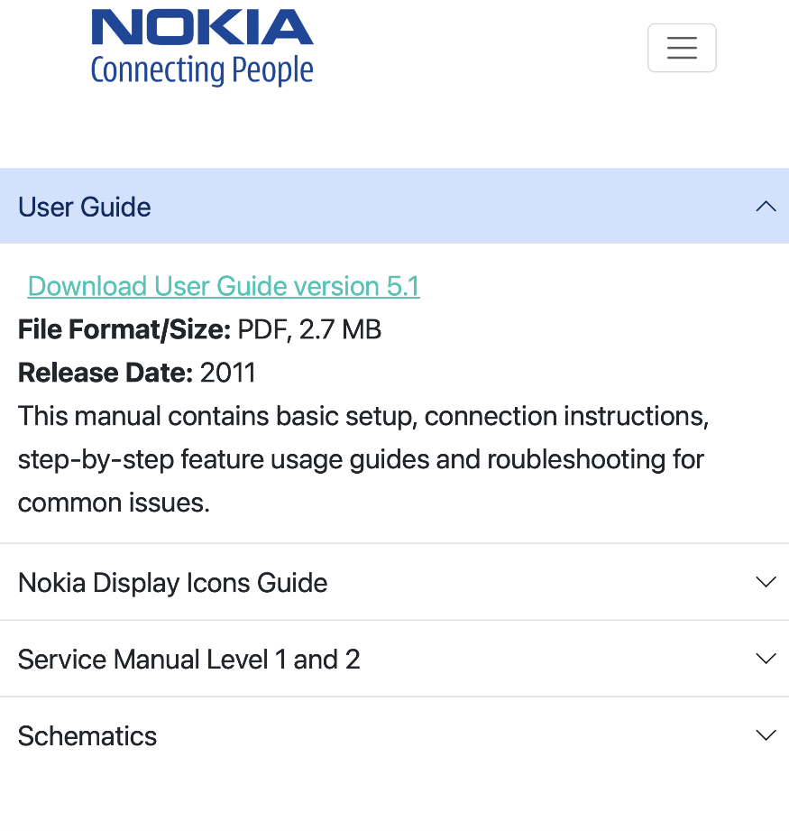

- As a repair technician or hobbyist, I want to access the service manual, so I can understand repair procedures.

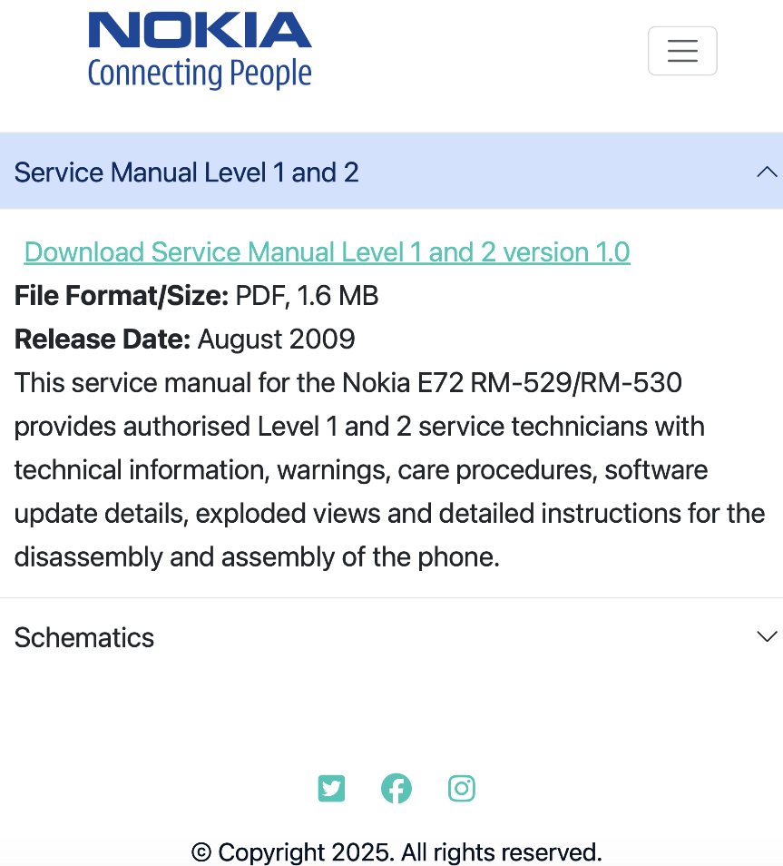

- As a researcher or collector, I want to view a clear technical specifications table, so I can compare the E72 with other phones.

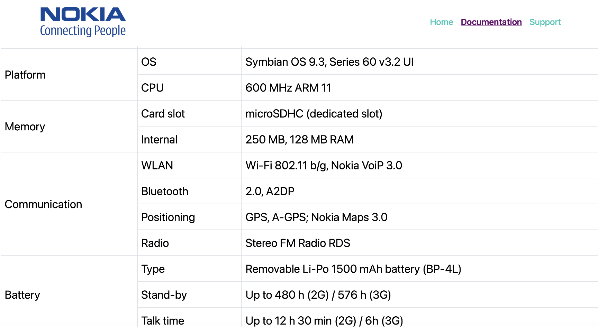

**Contact subpage** (form)
- As a visitor, I want to use a simple contact form, so I can ask for help troubleshooting the device.

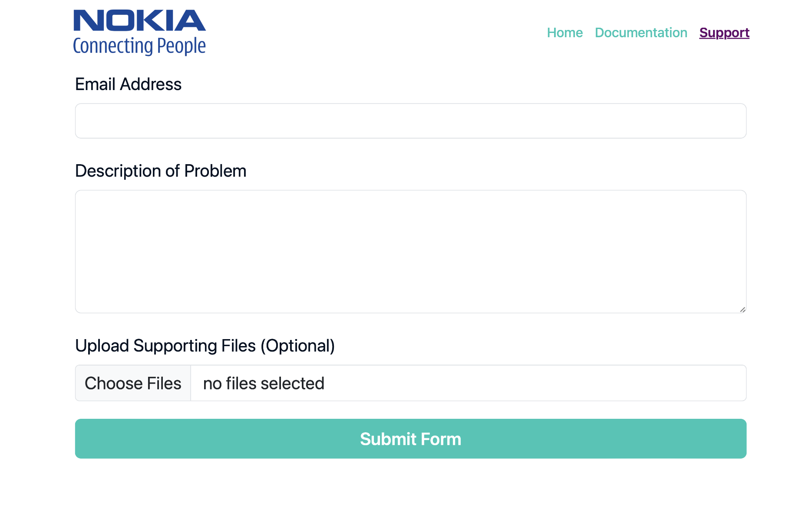

### Design Choices

**Colour Scheme**
The chosen palette creates a balance between professionalism and nostalgia, reflecting the Nokia brand’s corporate heritage while keeping the design clean and readable.

| Element | Purpose  | Colour | Hex Code | Preview |
| ------- | -------- | ------ | -------- | ------- |
| Text    | High-contrast readability| Very dark grey | #051122 | <span style="background-color:#051122; display:inline-block; width:20px; height:20px; border:1px solid #ccc;"></span>|
| Headings | Purple highlights and modern touch | Purple | #63036A | <span style="background-color:#63036A; display:inline-block; width:20px; height:20px; border:1px solid #ccc;"></span> |
| Background | Clarity and focus on content | White | #FFFFFF | <span style="background-color:#FFFFFF; display:inline-block; width:20px; height:20px; border:1px solid #ccc;"></span> |
| Buttons, URLs | Accent freshness and visual hierarchy | Teal | #06C6B5 | <span style="background-color:#06C6B5; display:inline-block; width:20px; height:20px; border:1px solid #ccc;"></span> |


**Fonts** 

The system font stack:
```css
font-family: -apple-system, BlinkMacSystemFont, "Segoe UI", Roboto, Helvetica, Arial, sans-serif; 
```
was selected for accessibility, legibility, and performance. It uses native system fonts to ensure fast loading times, consistent appearance across devices, and a clean, professional aesthetic suitable for a documentation-style site.

**Icons**
[Font Awesome](https://fontawesome.com) icons were used for social media links. They provide a visually intuitive way to recognise platforms and actions, while maintaining scalability and accessibility through proper ARIA labels.

**Styling**
The overall styling approach follows modern documentation design principles — a minimalist layout, generous white space and a consistent grid system using Bootstrap 5. This ensures the site remains easy to navigate, fully responsive and visually aligned with the structured nature of technical documentation.

### Wireframes
The wireframes were created in [Balsamiq](https://balsamiq.com) during the planning and design stage of the project.

**Homepage**

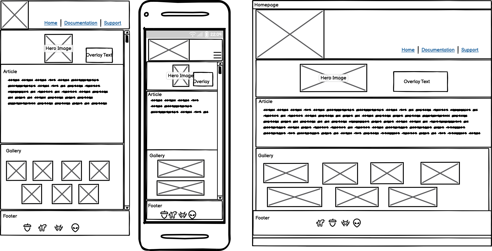

**Documentation Page**

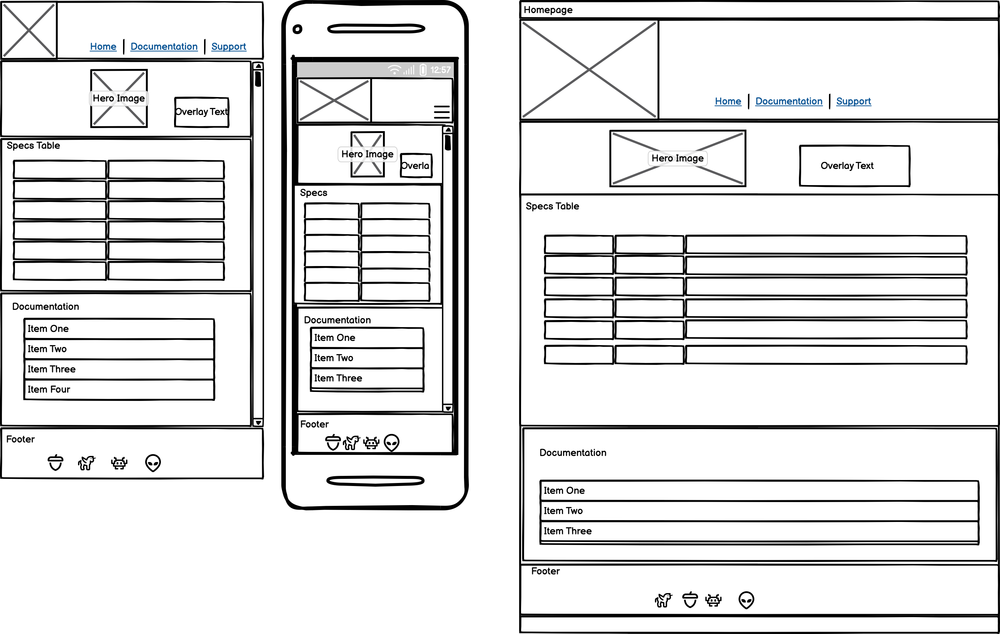

**Support Page**

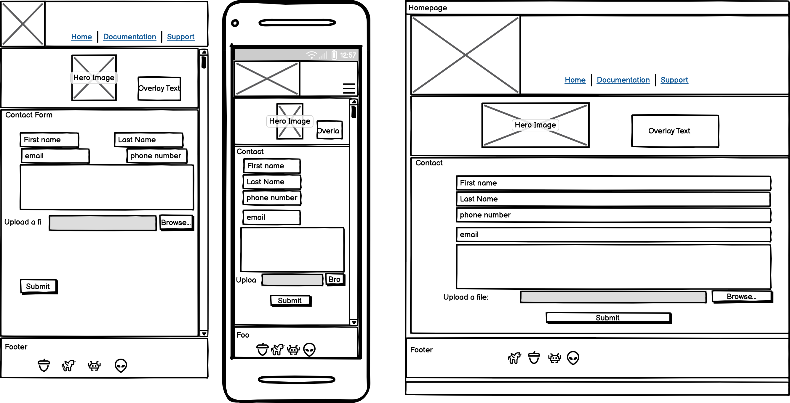

**Form Validation Page**

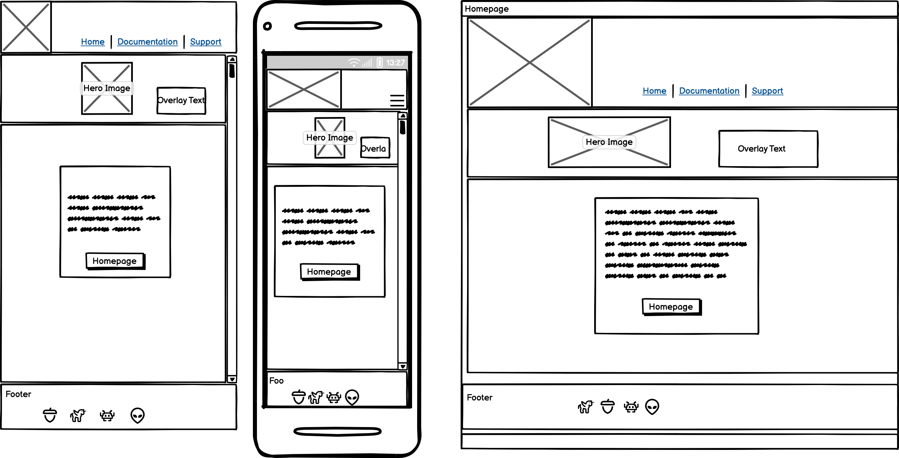

## Website Map

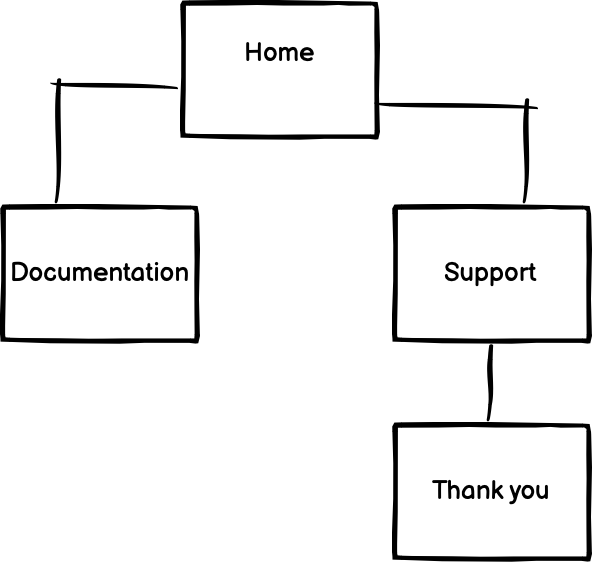

---
## Features
### Development Plan
The following tasks were planned and executed to ensure all website sections meet the UX goals and functional requirements.

**Homepage**
- Write a short, engaging description of the Nokia E72 (release date, features, relevance).
- Prepare and optimise gallery images (resize, compress for fast loading).
- Build homepage layout with description section + gallery grid/lightbox.

**Documentation Subpage**
- Source/upload user manual (PDF).
- Source/upload service manual (PDF).
- Create a clean specifications table (processor, display, camera, OS, memory, connectivity, etc.).
- Ensure all downloads are accessible and properly linked.

**Contact Subpage**
- Build a simple contact form with fields: Name, Email, Message, Attach File.
- Add validation (email format, required fields).
- Add thank-you/confirmation message after submission.

**General**
- Create simple, consistent navigation bar linking Homepage, Documentation, Contact.
- Apply responsive design (mobile-friendly).
- Test across major browsers.
- Add metadata for SEO (title, description, keywords like ‘Nokia E72 user manual’, ‘Nokia E72 specs’).

### Must-Haves (MVP – launch-ready)
**Homepage**
- [x] Write concise description of Nokia E72 (history, features).
- [x] Create image gallery (3–6 optimized photos).
- [x] Implement responsive layout (grid/lightbox for gallery).

**Documentation Subpage**
- [x] Upload and link user manual (PDF).
- [x] Upload and link service manual (PDF).
- [x] Build technical specifications table (CPU, OS, memory, camera, battery, etc.).

**Contact Subpage**
- [x] Create contact form (Name, Email, Message).
- [x] Add basic validation (required fields, email format).
- [x] Add confirmation message after submission.

**General / Core Site**
- [x] Navigation bar with links to Homepage, Documentation, Contact.
- [x] Responsive design (desktop, tablet, mobile).
- [x] Test in major browsers (Chrome, Edge, Firefox, Safari).
- [x] Add favicon, site title and meta description.

### Existing Features
* Fully responsive across devices using Bootstrap 5.3.
* Multi-page structure: Home, Documentation and Support.
* Accessible navigation bar and semantic HTML5 structure.
* Downloadable resources (PDF, XLS).
* Contact form with validation and confirmation page.
* SEO-optimised metadata.
* Custom favicon and consistent branding.

### Features Left to Implement
* Backend email integration (Formspree or Netlify Forms).
* Search functionality for manuals and specs.
* Dark mode toggle for accessibility.
* Multi-language support (English, German).

### Stretch Goals
* Add 3D interactive phone model.
* Enable user-submitted photos or tips.
* Integrate historical timeline of Nokia devices.

---
## Technologies Used
* HTML5 – Semantic structure and content markup.
* CSS3 – Custom styling and layout enhancements.
* Bootstrap 5.3 – Responsive grid, accordion, form and carousel components.
* Balsamiq 4.8.5 – Wireframe design tool.
* Visual Studio Code – Integrated Development Environment.
* GitHub – Version control and deployment platform.

---
## Testing
The website was tested on Macbook Pro M2 in Chrome (141) and Safari (18.2), on IPhone 13 Mini
in Safari (17.7.2) and on Ipad Air 5th Genaration in Safari (17.7.2). 

**Manual Testing Summary Table**
| Feature | Expected Result | Outcome | Status |
|----------|-----------------|----------|--------|
| Navigation links | Navigate to correct pages | Works as expected | Done |
| Contact form validation | Blocks empty/invalid input | Works as expected | Done|
| PDF downloads | Files open in new tab or download correctly | Works as expected | Done |
| Mobile responsiveness | Layout adjusts across devices | Verified on iPhone, Android | Done |

HTML and CSS was tested and validated using [W3C Validator](https://validator.w3.org)
All errors discovered were then corrected in Visual Code Studio.

**W3C CSS Validator Test**


Accessibility was reviewed using Chrome Lighthouse and manual checks for alt text, ARIA labels, and color contrast compliance.

**Lighthouse Test**


---
## Deployment
This project was deployed to GitHub pages using Visual Studio Code.

### Steps
1. The project was created locally in Visual Studio Code.
2. Tracked using Git and pushed to a public GitHub repository.
3. Deployed via GitHub Pages using the main branch.
4. The live site is available at: https://k2m13.github.io/milestone-project-1/

Future commits pushed to the `main` branch are automatically deployed via GitHub Pages.

### How to Run This Project Locally
1. Go to the repository: https://github.com/k2m13/milestone-project-1
2. Click Code → Download ZIP.
3. Extract the files and open index.html in your browser.
4. Alternatively, clone the repository using: 
```bash
git clone https://github.com/k2m13/milestone-project-1.git
```
---
## Credits
### Content
All text content was written by the developer based on publicly available Nokia E72 product information including [Fone Arena](https://www.fonearena.com/blog/9107/nokia-e72-is-finally-in-stores.html). Specifications table on Documentation page was prepared on the basis of [Telepolis](https://www.telepolis.pl/telefony/nokia/e72#dane-techniczne).
User Guide (version 5.1) was sourced from [here](http://download-fds.webapps.microsoft.com/supportFiles/phones/files/guides/Nokia_E72_UG_en.pdf). Service Manual Level 1 & 2 and Schematics came from [S-manuals](https://www.s-manuals.com/phone/nokia_e72). Nokia Display Icons spreadsheet was received from Nokia Customer Service representative. 

### Media

**Images** for the website were sourced from these pages:
* https://1000logos.net/nokia-logo/

* https://usashopwe.shop/ProductDetail.aspx?iid=724322550&pr=73.88

* https://manualzz.com/doc/o/lmeqi/nokia-e72-manual-de-usuario-linterna

* https://www.joom.com/en/products/658157f86b5257011f155f1f?srsltid=AfmBOoo71fwRLoPpf1Xm64jgWhkDktB1wiC0kfSKZ-nd2mFFn1Yeb2Ya 

* https://www.independent.co.uk/tech/nokia-gets-new-communicator-app-office-suite-as-it-shake-hands-with-microsoft-1964544.html

* https://www.ebay.co.uk/itm/135222103882

* https://www.gearbest.ma/product/finland-made-e72-mobile-cell-phone-gsm-2g-3g-unlocked-5mp-camera-240x320-display-resolution-support-multi-language-used-phone/

* https://www.ebay.co.uk/itm/335440241218

* https://www.slashgear.com/otterbox-nokia-e72-cases-arrive-1065709/

**Favicon** was sourced from [ICONFINDER](https://www.iconfinder.com/search?q=nokia)

### Code
* Bootstrap documentation for component structure and responsive grid system.
* CSS variables and structure inspired by modern front-end best practices.

### Acknowledgements 
The developer would like to thank Code Institute for equipping him with knowledge and skills to complete this milestone project no. 1.

### Disclaimer
This project is for educational and non-commercial purposes.

---
## License
This project is open source and available under the [MIT License](LICENSE).
